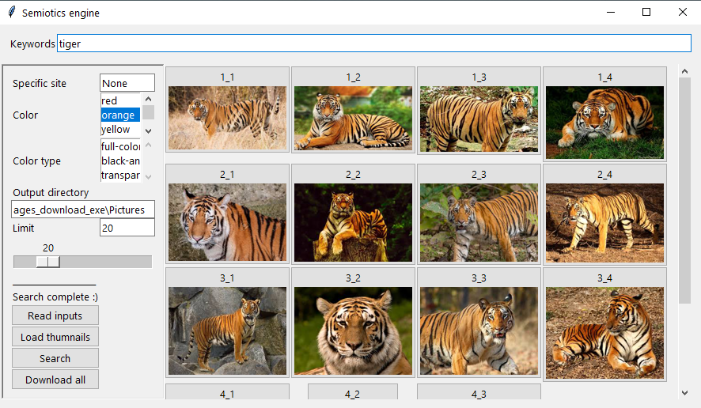
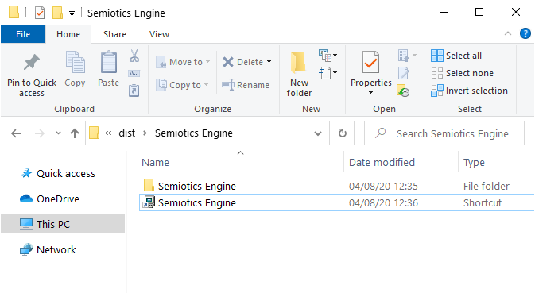
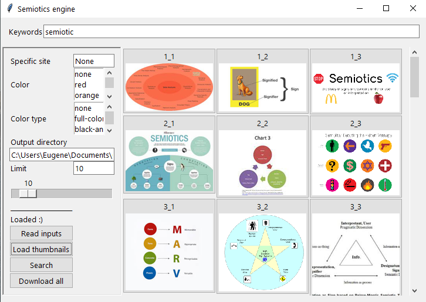

# Product Name

This is a batch downloader for Google images as a Windows executable which does not require any installation.

WARNING: Currently not working due to changes in Google's webpages.

# Product description

This executable provides simple and fast way to search and download Googe images in a simple GUI for users not using Python. The download functionalities come from google-images-download by hardikvasa (https://github.com/hardikvasa/google-images-download/), and this project adds a simple Tkinter GUI and has packaged in PyInstaller executable.

Start by entering your search terms (keywords, colour, specific site, # limit) into the entry boxes in the interface, then click "Search". The program will search Google, automatically download thumbnails (quantity up to the limit), and display the thumbnails in the interface. The images can be downloaded either altogether with the "Download all" button or individually by clicking on the image (work in progress).

## Installation

Windows:

Download Semiotics.Engine.v[x.y.z].zip from https://github.com/eyjho/google_images_download_exe/releases. Extract into your working directory, and run using the shortcut. No installation required. All images will be downloaded into the \Pictures directory by default, which will be in the same directory as the shortcut, or the directory above the .exe file. Note that the shortcut in the package is a relative link, and therefore will not work if moved. For a moveable shortcut, find Semiotics Engine\Semiotics Engine.exe, and create a shortcut.

OS X & Linux: TBC

## Usage example
1. Run the program by clicking on the shortcut or Semiotics Engine\Semiotics Engine.exe. A command line console will appear, showing some outputs in the background. If this is closed, the GUI will also exit.
1. Enter search term and other serach parameters.
2. Click the "Search" button or press enter from the search text input box. The program find and display the images.
3. Click on an image to download it individually.
4. Click the "Download all" button to download the batch of images.

_For more examples and usage, please refer to the [Wiki][wiki]._

## Release History

* 0.1.1
    * FIX: issue #1 and typos
* 0.1.0
    * The first working release
* 0.0.1
    * Work in progress

## Meta

Eugene (https://github.com/eyjho)

Distributed under the MIT license. See ``LICENSE`` for more information.

https://github.com/eyjho/google_images_download_exe

<!-- Markdown link & img dfn's -->
[npm-image]: https://img.shields.io/npm/v/datadog-metrics.svg?style=flat-square
[npm-url]: https://npmjs.org/package/datadog-metrics
[npm-downloads]: https://img.shields.io/npm/dm/datadog-metrics.svg?style=flat-square
[wiki]: https://github.com/yourname/yourproject/wiki
